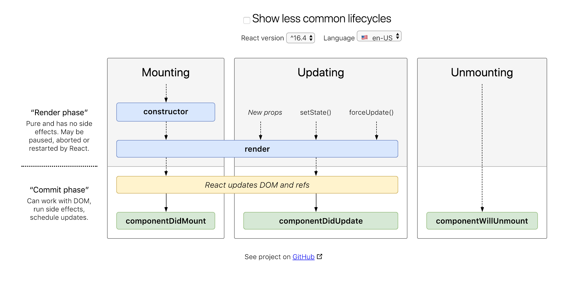

# Learning Summary

Reference:

Complete React Tutorial: https://www.youtube.com/watch?v=OxIDLw0M-m0&list=PL4cUxeGkcC9ij8CfkAY2RAGb-tmkNwQHG

Yes, React is taking over front-end development. The question is why. https://medium.freecodecamp.org/yes-react-is-taking-over-front-end-development-the-question-is-why-40837af8ab76

Difference between state and props
https://stackoverflow.com/questions/27991366/what-is-the-difference-between-state-and-props-in-react

Note that most of materials here are based on the **Complete React Tutorial** above.

* React is a **Javascript library**, but not a framework.

* React is all about **components**. Traditionally, you place all the UIs of a page in a single HTML file. But now you can split the UI into several componenets. Each component accepts properties (prop) and interact with its own state to return the UI to the screen. And this also leads to the **reusability** of the components throughout the application.

* There are two types of React Components, namely **function** and **class** components. Function component is stateless, meaning it takes "props" from somewhere else and render it to the screen. Basically, it is just a Javascript function. On the other hand, class component does have state. It is a Javascript class which extends from the React Component class. Note that class compoennts have to implement the **render()** method and it can use the lifecycle hook method as well (lifecycle hook method is not possible in function component)

* In your component, you define how you want the UI like in something very similar to HTML, which is called JSX (Javascript XML).

* React creates a **Virtual DOM** behind the scenes. It keeps monitoring the state of the components. Whenever there are updates, it triggers an update to the **corresponding** part of the screen (DOM) instead the whole part.

* When manipulating the state, be careful not to modify the state directly, like **this.state.posts.push(...)**. Instead, clone the array first and assign the new array back to the state by the **this.setState()** method.

* There are several lifecycle methods available for use.

* One thing to keep in mind is the difference between props and state. State is mutable and fully controlled by its component. If necessary, it can be passed to its child component as props. Indeed, you could pass data and event handlers down to the child components. In this way, the props are immutable. (For example, you have an event handler called addPost and a state called posts in your parent component, you pass the event handler down the child component, **the child component can communicate with the parent component**)

* Definition of Higher Order Component (HOC) from Docs: Concretely, a higher-order component is a function that takes a component and returns a new component. It can add extra functionalities to the wrapped component.

### Useful Javascript Techniques

* [Destructuring Assignment](https://developer.mozilla.org/en-US/docs/Web/JavaScript/Reference/Operators/Destructuring_assignment)

* [Spread Syntax](https://developer.mozilla.org/en-US/docs/Web/JavaScript/Reference/Operators/Spread_syntax)